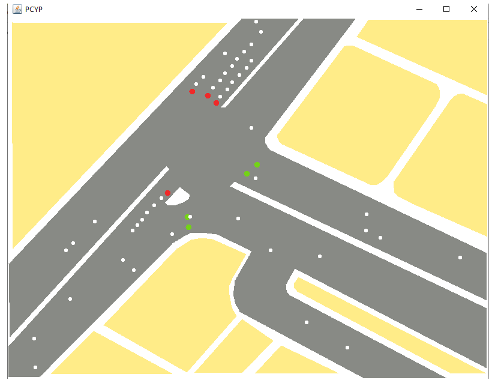

# Dromos app java

# Table of contents
- [Introduction](#introduction)
- [Description](#description)
- [Credits](#credits)
- [About the docs](#about-the-docs)
- [Java 17 install](#java-17-install)

## Introduction
- Run program with terminal or powershell
```powershell
cd src
java -cp ./streets.jar streets/simulacion/Simulacion
```
- Screenshots
    

## Description

This program follows the fundamentals of 2D programming with java, as well as concurrent and pararell programming. The general idea that this project has is that by using the concept of semaphore it's possible that multiple threads can communicate with each other thus preventing deadlocks and data corruption.

In this example we have the location of Prol. de la 14 Sur, Av San Claudio &, Cdad. Universitaria, 72592 Puebla, Pue. it's used as an example of a simulation for this concept, each street has a semaphore and it's being used by a random number of cars (the with dots), the programming makes sure that there are never any "accidents" by making each thread look in front of him if there are any cars using the cords and being sure to never cross the street if the semaphore it's yellow or red, if the semaphore it's in any of these conditions the car (thread) stops, and the other threads not only read the state of the semaphore but also prevents himself to crash with the car in front of him. 

Another important feature of this program is that not a single thread survives after completing it's path, this way we don't have thousands of threads being used by the operative system, otherwise the program would crash or the machine would freeze.

This description it's very short but if you have any questions please don't doubt of contacting me with my email, it's a project from 7 years ago, it was a project for the PCYP class that i had with Mireya Tovar teacher, i did it all by myself and now 7 years later it's back for my portfolio.

The source code it's located inside the src/streets/streets folder.

## Credits
If you want to read one of the best books i have ever read in my life please purchase a copy at amazon.com, the original version:
    - https://www.amazon.com/Fundamental-2D-Game-Programming-Java/dp/1305076532


I think there is not an spanish translation, but again if you want to discuss a chapter of the book i would be happy to be contacted.

Mireya Tovar is one of the best teachers in the world, it's not an opinion it's a fact, i believe she's still working as a BUAP teacher.

## About the docs
Please understand that this project was not the only one that i had to work with that year of my education at BUAP, so naturally the docs are poorly writed but in my defense, not a single teacher really reads them anyway.

## Java 17 install

### Windows 10

- Search for Advanced System Settings in your windows Search box. Click on Advanced System Settings.
- Click on Environment variables button: Environment Variables popup will open.
- Goto system variables session, and click on New button to create new variable (HOME_PATH), then New System Variables popup will open.
- Give Variable Name: JAVA_HOME, and Variable value : Your Java SDK home path. Ex: C:\Program Files\java\jdk1.8.0_151 Note: It should not include \bin. Then click on OK button.
- Now you are able to see your JAVA_HOME in system variables list. (If you are not able to, try doing it again.)
- Select Path (from system variables list) and click on Edit button, A new pop will opens (Edit Environment Variables). It was introduced in windows 10.
- Click on New button and give %JAVA_HOME%\bin at highlighted field and click Ok button.

### Debian and Fedora
- I tested this with Debian 10 and 11, fedora 35 and ubuntu 20, it works without errors

```powershell

sudo mkdir /usr/lib/jvm
cd /usr/lib/jvm
ls ~/Downloads
sudo tar -xvzf ~/Downloads/jdk-17.0.4.1_linux-x64_bin.tar.gz

nano ~/.bashrc
: '
export PATH="$PATH:/usr/lib/jvm/jdk-17.0.4.1/bin"
JAVA_HOME="/usr/lib/jvm/jdk-17.0.4.1"
'

sudo update-alternatives --install "/usr/bin/java" "java" "/usr/lib/jvm/jdk-17.0.4.1/bin/java" 0
sudo update-alternatives --install "/usr/bin/javac" "javac" "/usr/lib/jvm/jdk-17.0.4.1/bin/javac" 0
sudo update-alternatives --set java /usr/lib/jvm/jdk-17.0.4.1/bin/java
sudo update-alternatives --set javac /usr/lib/jvm/jdk-17.0.4.1/bin/javac

update-alternatives --list java
update-alternatives --list javac

java --version
javac --version
```

